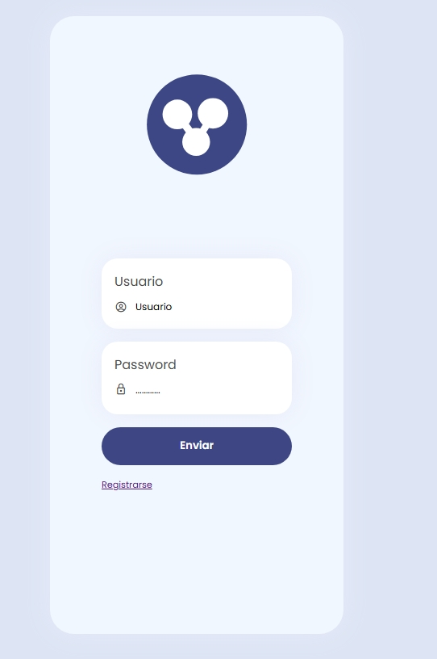
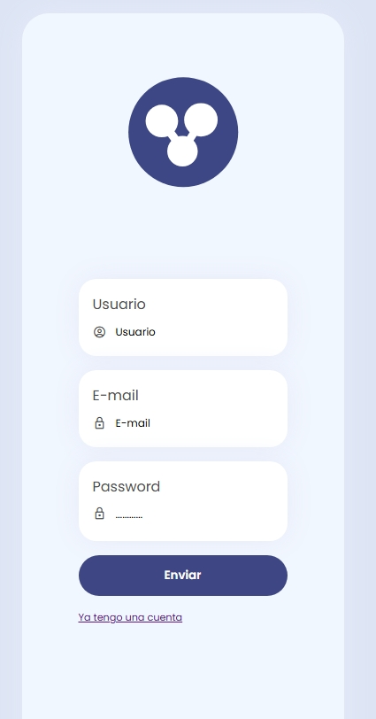
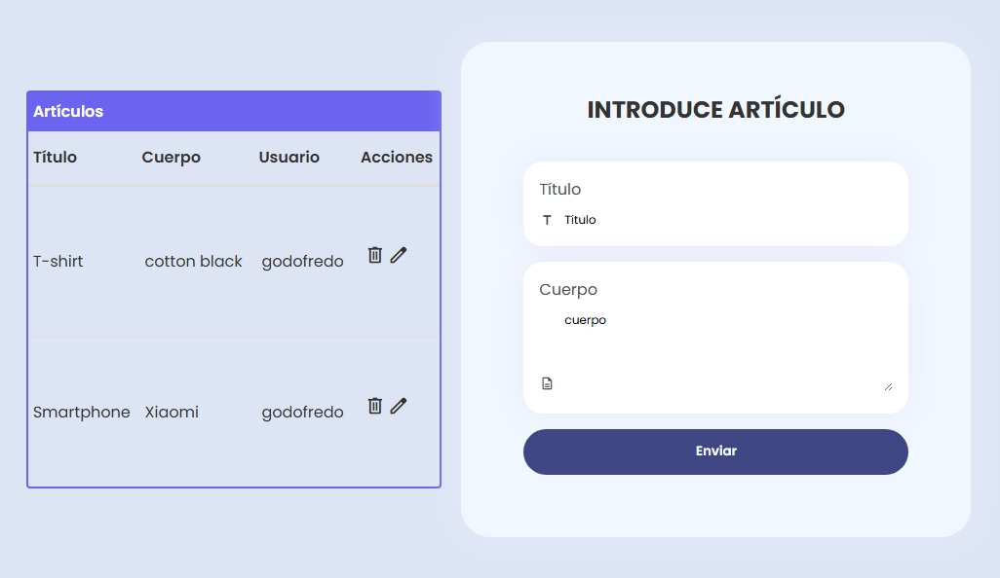

CRUD de articulos + login de usuarios
Tecnologias: Stack MERN

Backend:

- Realizamos una API REST con nodejs + express
- En dicha api manejamos crud de usuarios y articulos
- El login de usuario cuenta con validacion de json web token
- Usamos una arquitectura MVC
- Con inyeccion de modelos
  Podemos alternar entre modelo mongodb o local stroge
- Protegimos rutas /api/articulos con autenticacion

Frontend:

- Realizamos el frontend con React
- Tenemos 3 paginas:
  - login
    
  - registro
    
  - articulos
    tabla CRUD de articulos
    
